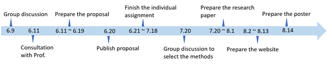

```{r setup, include=FALSE}
knitr::opts_chunk$set(echo = FALSE)
```
# 1.Introduction

As part of the VAST 2021 data visualization challenge. The task given is a scenario set in the fictional region of Kronos, where the natural gas production company GAStech has operated in the region for roughly 20 years. While the company has been successful throughout the period, some citizens of Kronos believes that their operations has not been responsible environmentally, most notably the group Protectors of Kronos (PoK). This culminates up to the current year where GAStech has successfully launched their IPO. However, some employees has been missing with PoK being suspected behind the scenes.

As data visualization experts, we were called by the authorities of Kronos and Thetys, the region where GAStech originated, to help visualize the events happening and find anything in the data that may help understand more about the missing employees. 

# 2. Challenge Taken

For this project, the challenge that was taken is the second mini-challenge, which is to find insights based on the geospatial data provided by the company cars assigned to the employees of GAStech as well as historical data of purchases made by said employees.

# 3. Objectives

Based on the given tasks, the main outline of this project can be listed as follow:

* Identify the most popular locations frequented by the missing employees and collect insights using the historical data. In addition, anomalies are to also be noted and attempted to be explained.

* Analyze the anomalies with the addition of location data of the assigned company vehicles and note the discrepancies present.

* Match the employees with their credit cards, and subsequently, their purchasing and travelling behavior.

* Identify both formal and informal relationships between the employees.

* Identify any suspicious activities occurring between the employees.

# 4.Assignment

Below are the assignments we will take:

   Group Members  | Assignments
------------------|-----------------
 Ahmad Fady Ganis | Mini-Challenge 2    
 Qinyu Wang       | Mini-Challenge 2
 Ruiyun Yan       | Mini-Challenge 2
 
 
# 5.Schedule
 
 
 
# 6. GitHub Link

Please click [here](https://github.com/ISSS608-G1-Group11/ISSS608_Group_Project)
